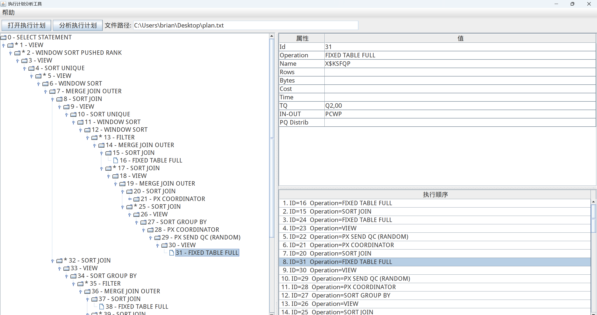
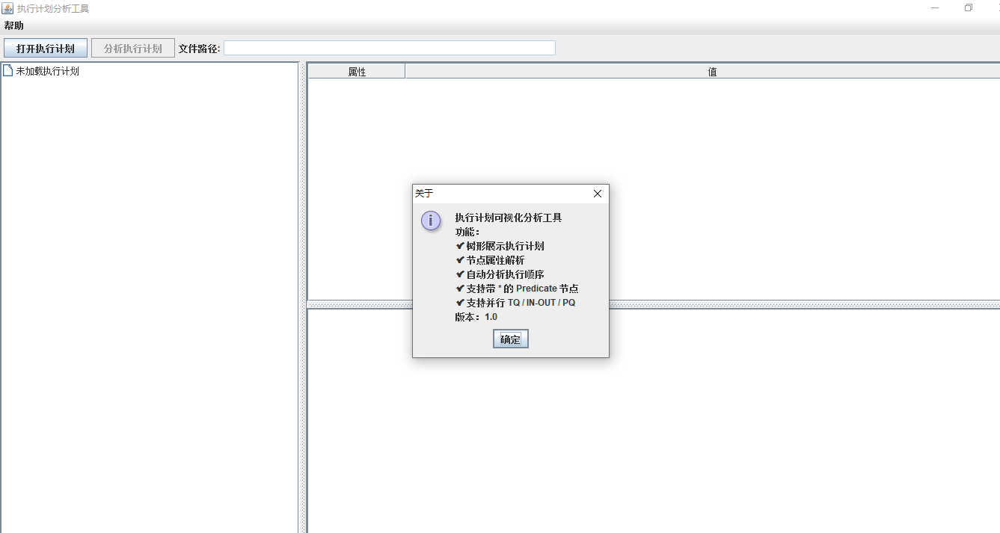

# AwesomeOracleSQLPlanVisualizer

[](https://www.oracle.com/java/)
[](LICENSE)

一个基于 Java Swing 的 Oracle 执行计划可视化分析工具。

用于将数据库控制台导出的执行计划文本（EXPLAIN PLAN / DBMS_XPLAN 输出）转换为树形结构展示，并支持节点属性查看与执行顺序分析 **（串行模式）**。

---

## ✨ 功能特性

- ✅ 执行计划树形结构可视化（JTree）
- ✅ 节点属性详情展示（JTable）
- ✅ 支持完整执行计划字段解析：
    - Id
    - Operation
    - Name
    - Rows
    - Bytes
    - Cost
    - Time
    - TQ
    - IN-OUT
    - PQ Distrib
- ✅ 支持带 `*` 的 Predicate 节点解析
- ✅ 支持并行执行计划（PX / TQ 解析）
- ✅ 执行顺序自动分析（底部滚动面板展示）
- ✅ 文件打开与分析动作分离
- ✅ 模板文件下载功能
- ✅ 软件“关于”菜单说明

---

## 🖥 软件界面结构




## 📂 项目结构

```tree
<root project>
│
├── com.example.core                  // 核心逻辑模块
│   ├── PlanNode.java     // 执行计划节点类
│   ├── PlanParser.java   // 执行计划解析器
│   └── MainConsole.java  // 控制台主入口（可选）
│
├── com.example.ui                    // 用户界面模块
│   ├── MainFrame.java    // 主窗口类
│   ├── PlanVisualizer.java // 执行计划可视化面板
│   ├── DetailPanel.java  // 节点详情展示面板
│   └── PlanTreeRenderer.java // 树形渲染器
│
├── resources                  // 静态资源
│   └── plan.txt
│
└── com.example.AppLauncher.java      // 应用启动类
```

## ⚙️ 运行环境要求

| 组件         | 版本                    | 说明                     |
| ------------ | ----------------------- | ------------------------ |
| **操作系统** | Windows / macOS / Linux | 全平台64位支持           |
| **Java**     | **JDK>= 8**             | 推荐使用JDK9+，兼容高分辨率   |
| **执行计划（重要！！）** |  由 [Oracle SQL Developer](https://www.oracle.com/cn/database/sqldeveloper/) 生成的执行计划         | 输入格式参考[模板文件](./src/resources/template/plan.txt) |

## 🚀 快速开始（GUI模式）

推荐通过 `JRE`环境 和 下载 `AwesomeOracleSQLPlanVisualizer.jar` 运行

### Windows / MacOS 平台

1. 下载 [最新 Release下的JAR包](https://github.com/Brian417-cup/AwesomeOracleSQLPlanVisualizer/releases/tag/v1.0.0) ，配置JRE8+环境
2. 终端执行：

  ```bash
java -jar <AwesomeOracleSQLPlanVisualizer.jar完整路径>
  ```

> 💡 *如果有需要，在Windows平台可以通过 exe4j 等软件将jre和jar包打包成一个可执行文件来一键运行！！*

### Linux 平台

1. 下载 [最新 Release下的JAR包](https://github.com/Brian417-cup/AwesomeOracleSQLPlanVisualizer/releases/tag/v1.0.0) ，配置JRE8+环境
2. 配置 X Server 环境（针对终端服务器，否则跳过这步）

  ```bash
export DISPLAY=<客户端IP>:0.0
  ```

3. 终端执行：

  ```bash
java -jar <AwesomeOracleSQLPlanVisualizer.jar完整路径>
  ```